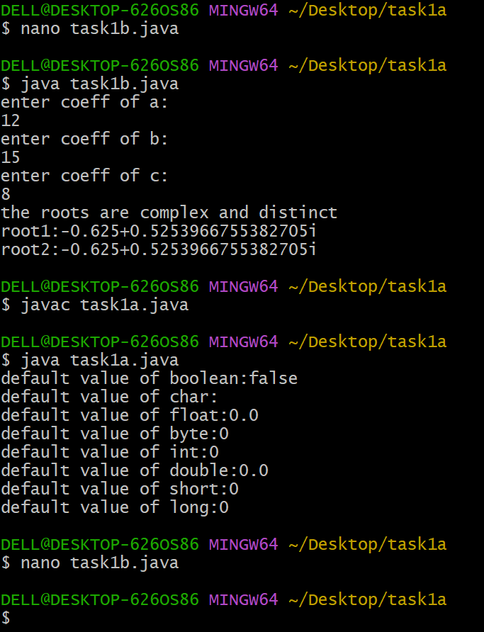

# EXPERIMENT 1
## TITLE : 1b.) Display the roots of quadratic equation'
```
import java.util.Scanner;
public class task1b{
public static void main(String[] args) {
Scanner s=new Scanner(System.in);
System.out.println("enter coeff of a:");
double a=s.nextDouble();
System.out.println("enter coeff of b:");
double b=s.nextDouble();
System.out.println("enter coeff of c:");
double c=s.nextDouble();
double discriminant=b*b-4*a*c;
if(discriminant>0)
{
double root1=(-b+Math.sqrt(discriminant))/(2*a);
double root2=(-b-Math.sqrt(discriminant))/(2*a);
System.out.println("the roots are real and distinct");
System.out.println("root 1:"+root1);
System.out.println("root 2:"+root2);
}
else if(discriminant==0)
{
double root=-b/(2*a);
System.out.println("the root is real and equal.");
System.out.println("root."+root);
}
else
{
double realpart=-b/(2*a);
double imaginarypart=Math.sqrt(-discriminant)/(2*a);
System.out.println("the roots are complex and distinct");
System.out.println("root1:"+realpart+"+"+imaginarypart+"i");
System.out.println("root2:"+realpart+"+"+imaginarypart+"i");
}
}
}
```
# OUTPUT

